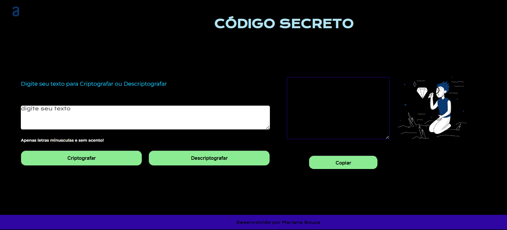

<h1>CÓDIGO SECRETO</h1>

<h2>🔖 Sobre</h2>

 O desafio "Challenge Decodificador de Texto" faz parte da trilha de cursos de formação do Programa ONE, parceria de Alura + Oracle.

 Esse desafio consiste em construir um decodificador de texto onde poderemos criptografar e descriptografar mensagens.

Foi utilizado um modelo do Figma para orientação e inspiração e, o Trello, para gerir o desenvolvimento do projeto e acompanhar o andamento das atividades

## 🚀 Tecnologias

  
  
  

<h2> Melhorias aplicadas no desafio</h2>

* Estilização dos notões: utilizei o efeito "HOVER" nos botões de modo que quando passamos o cursor por cima, eles são destacados em outra cor.
* Layout Responsivo: neste projeto utilizei o "media query", definindo assim, um tamanho de tela para o celular outro para o tablet e deixar a “padrão” para o desktop.

## Layout
<h2>Layout</h2>

  

